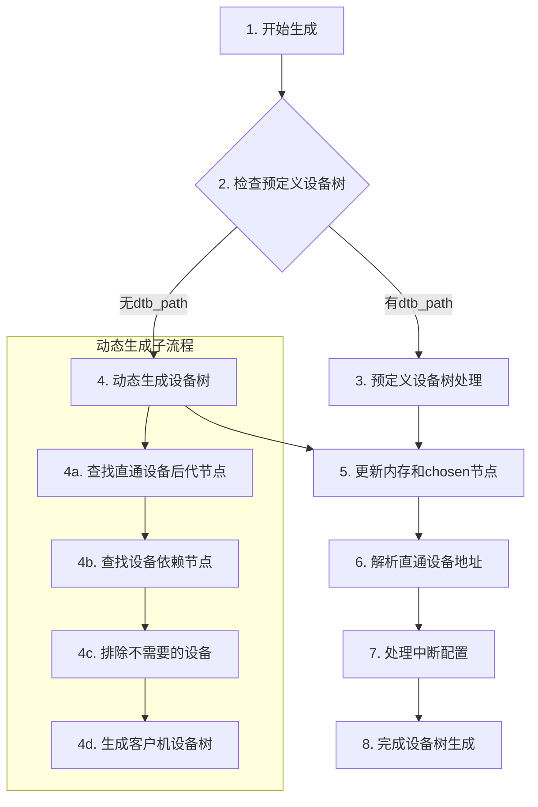

# AxVisor FDT 设备树处理完整技术指南

---

## 第一部分：使用说明

### 1. 快速开始

AxVisor 的设备树（FDT）处理模块为 AArch64 架构的虚拟机提供定制化的设备树生成服务。根据您的需求，可以选择以下两种使用方式：

#### 方式一：使用预定义设备树文件
```toml
[kernel]
dtb_path = "/path/to/your-custom.dtb"
```
适用场景：您已经有完整的、经过验证的设备树文件，只需要更新CPU和内存信息。

#### 方式二：动态生成设备树
```toml
[kernel]
# dtb_path = ""  # 不配置此字段，触发动态生成
```
适用场景：需要根据配置灵活选择直通设备，实现动态的设备分配。

### 2. 配置文件完整模板

以下是一个完整的 VM 配置模板，包含了所有 FDT 相关的配置选项：

```toml
[base]
id = 1                      # VM 唯一标识
name = "my-vm"              # VM 名称，用于日志和调试
vm_type = 1                 # 虚拟化类型（固定为1）
cpu_num = 2                 # 虚拟CPU数量
phys_cpu_ids = [0x200, 0x201]  # 物理CPU ID列表

[kernel]
# 镜像配置
entry_point = 0x80200000    # 内核入口地址
image_location = "memory"   # 镜像位置："memory" 或 "fs"
kernel_path = "Image"       # 内核文件路径
kernel_load_addr = 0x80200000  # 内核加载地址

# 设备树配置
dtb_path = ""               # 留空表示动态生成，或指定文件路径
dtb_load_addr = 0x80000000  # 可选：DTB加载地址

# 内存区域配置
memory_regions = [
    [0x80000000, 0x20000000, 0x7, 1],  # 基地址, 大小, 权限, 映射类型
    [0xa0000000, 0x10000000, 0x7, 0]
]

[devices]
# 直通设备配置（仅在动态生成时生效）
passthrough_devices = [
    ["/soc/uart@2800c000"],           # 简化路径格式（推荐）
    # 或者传统格式：
    # ["uart0", 0x2800c000, 0x2800c000, 0x1000, 0x1]
]

# 排除设备配置
excluded_devices = [
    ["/gic-v3"],                      # 排除中断控制器
]

# 直通地址配置
passthrough_addresses = [
    [0x28041000, 0x1000000],         # 基地址, 长度
]
```

### 3. 常见使用场景配置

#### 3.1 最小配置 - 仅UART设备
```toml
[base]
id = 1
cpu_num = 1
phys_cpu_ids = [0x200]

[kernel]
image_location = "memory"
memory_regions = [[0x80000000, 0x10000000, 0x7, 1]]

[devices]
passthrough_devices = [
    ["/soc/uart@2800c000"]           # 仅直通串口，用于调试
]
```

#### 3.2 多设备直通配置
```toml
[devices]
passthrough_devices = [
    ["/soc"],                         # 直通整个SOC域
    ["/pcie@30000000"]               # 直通PCIe域
]
excluded_devices = [
    ["/soc/power@fdc20000"],          # 排除电源管理
    ["/soc/thermal@fdc60000"]         # 排除温度传感器
]
```

#### 3.3 开发调试配置
```toml
[devices]
passthrough_devices = [
    ["/"]                             # 直通所有设备，便于调试
]
# 注意：生产环境不建议使用此配置
```

### 4. 配置验证清单

在启动 VM 前，请确认以下配置项：

- [ ] `phys_cpu_ids` 中的值在主机设备树中存在
- [ ] `memory_regions` 中的地址空间不重叠
- [ ] `passthrough_devices` 中的路径在设备树中存在
- [ ] 如果使用 `dtb_path`，文件路径正确且可访问
- [ ] 内存映射类型（第4个字段）配置正确

---

## 第二部分：原理说明

### 1. 设备树在虚拟化中的作用机制

#### 1.1 硬件抽象层的核心地位

设备树（FDT，Flattened Device Tree）在现代 ARM 系统中扮演着硬件抽象层的核心角色。它是一种描述硬件配置的数据结构，由 Bootloader 加载并传递给操作系统。

在 AxVisor 虚拟化环境中，设备树承担着三个关键角色：

1. **硬件发现者**：宿主机启动时，AxVisor 首先解析主机的设备树，了解可用的物理硬件资源，包括：
   - CPU 的数量和类型
   - 内存布局和容量
   - 中断控制器类型和配置
   - 各种 I/O 设备的地址空间和属性

2. **资源分配器**：基于对物理资源的了解，AxVisor 可以智能地为多个虚拟机分配资源：
   - 为每个 VM 分配特定的 CPU 核心
   - 划分内存区域，确保 VM 间的隔离
   - 配置中断路由，避免冲突

3. **虚拟化构建者**：AxVisor 不是简单地传递原始设备树，而是为每个 VM 构建定制的虚拟设备树，包含：
   - 分配给该 VM 的 CPU 节点
   - VM 的内存映射信息
   - 配置为直通的物理设备
   - 虚拟化的系统设备

#### 1.2 设备树的数据结构原理

设备树采用树形层次结构，每个节点代表一个硬件设备或组件，节点属性以键值对形式描述设备特性。

```
根节点 (/)
├── cpus (CPU节点)
│   ├── cpu@0 (CPU核心0)
│   └── cpu@1 (CPU核心1)
├── soc (系统级芯片)
│   ├── uart@2800c000 (串口设备)
│   └── gpio@fe760000 (GPIO设备)
└── memory@80000000 (内存区域)
```

每个节点的关键属性：
- `compatible`: 设备兼容性字符串，用于驱动匹配
- `reg`: 地址和大小信息，定义设备的物理地址空间
- `interrupts`: 中断信息，指定中断号和触发方式
- `phandle`: 节点标识符，用于其他节点的引用

### 2. 两种生成模式的深层原理

#### 2.1 预定义模式的适用场景和原理

**适用场景**：
- 设备树经过严格验证，确保稳定性
- 需要特定的设备配置，不希望自动处理
- 来自硬件供应商的标准设备树

**工作原理**：
当配置了 `dtb_path` 时，AxVisor 采用最小干预策略：

1. **加载验证**：读取指定的设备树文件，验证格式正确性
2. **CPU 节点更新**：从主机设备树提取 CPU 信息，根据 `phys_cpu_ids` 过滤和更新
3. **内存节点更新**：根据 `memory_regions` 配置，重新生成内存节点
4. **直通地址处理**：如果有完整的设备配置，直接应用地址映射

**优势**：保持原有设备树的完整性，降低引入错误的风险
**劣势**：灵活性受限，无法动态调整设备配置

#### 2.2 动态生成模式的智能处理机制

**适用场景**：
- 需要根据不同 VM 配置灵活调整设备
- 希望系统自动处理设备依赖关系
- 需要精确控制设备直通范围

**工作原理**：
动态生成采用分析驱动的构建方式：

1. **设备发现阶段**：
   - 解析配置中的 `passthrough_devices`
   - 查找每个直通设备的所有后代节点
   - 构建设备路径的完整树形结构

2. **依赖分析阶段**：
   - 分析每个设备的 phandle 引用
   - 识别时钟、电源、中断等依赖设备
   - 递归解析依赖关系，确保完整性

3. **过滤处理阶段**：
   - 应用 `excluded_devices` 配置
   - 移除指定设备及其后代节点
   - 确保最终设备列表的一致性

4. **生成构建阶段**：
   - 根据 NodeAction 分类处理每个节点
   - 重新构建设备树的层次结构
   - 生成二进制的 DTB 文件

**优势**：高灵活性，智能依赖处理，精确控制
**劣势**：计算开销较大，需要更多验证

### 3. 设备直通的依赖关系原理

#### 3.1 Phandle 机制的核心作用

Phandle（property handle）是设备树中的节点引用机制，类似于编程语言中的指针。每个节点可以有一个或多个 phandle 属性，其他节点通过引用这些 phandle 来建立依赖关系。

**Phandle 声明方式**：

```dts
// 方式1：显式声明
clock_controller: clock@fdd20000 {
    compatible = "vendor,clock";
    reg = <0xfdd20000 0x1000>;
    phandle = <0x100>;        // 显式设置phandle值
};

// 方式2：标签声明（编译器自动生成）
clock: clock@fdd20000 {       // 定义标签
    compatible = "vendor,clock";
    reg = <0xfdd20000 0x1000>;
    // 编译器会自动分配phandle
};
```

**Phandle 引用方式**：

```dts
uart0: serial@2800c000 {
    compatible = "vendor,uart";
    clocks = <&clock 0x14a>;    // 引用时钟节点
    interrupt-parent = <&gic>;   // 引用中断控制器
};
```

编译后，`&clock` 会被替换为具体的 phandle 值，如 `clocks = <0x100 0x14a>`。

#### 3.2 依赖类型解析

AxVisor 支持 15+ 种依赖类型的自动识别和解析：

**时钟依赖（Clock Dependencies）**：
```
clocks = <&clk_uart>, <&clk_apb>;
clock-names = "baudclk", "apb_pclk";
```
解析时会自动找到对应的时钟控制器节点，确保 UART 设备有可用的时钟源。

**电源域依赖（Power Domain Dependencies）**：
```
power-domains = <&pmu 0x3>;
```
确保设备在使用前，对应的电源域已正确初始化。

**中断依赖（Interrupt Dependencies）**：
```
interrupt-parent = <&gic>;
interrupts = <0x0 0x73 0x4>;  // GIC_SPI, IRQ 115, 上升沿
```
建立设备与中断控制器的连接关系。

**GPIO 依赖（GPIO Dependencies）**：
```
gpios = <&gpio0 0x5 0x0>;  // GPIO控制器, GPIO号, 配置标志
```
处理设备对 GPIO 引脚的控制需求。

#### 3.3 依赖解析算法

AxVisor 采用工作队列算法进行递归依赖分析：

```
工作队列算法：
1. 初始队列：配置的直通设备
2. 循环处理：
   a. 取出队首设备
   b. 分析其所有 phandle 属性
   c. 将依赖设备加入队列（如果未处理过）
   d. 标记当前设备为已处理
3. 结束条件：队列为空
```

这种算法确保：
- **完整性**：所有传递依赖都被发现
- **无重复**：每个设备只处理一次
- **无循环**：通过已处理集合避免死循环

### 4. 地址映射和中断路由原理

#### 4.1 地址映射的三种模式

**MAP_ALLOC（类型0）**：
- 宿主机为 VM 分配新的物理内存页
- GPA（客户机物理地址）与 HPA（宿主机物理地址）无直接关系
- 适用于标准内存分配场景

**MAP_IDENTICAL（类型1）**：
- GPA 与 HVA（宿主机虚拟地址）建立 1:1 映射关系
- 起始地址由宿主机随机分配
- 适用于需要高地址一致性的场景

**MAP_RESERVED（类型2）**：
- 将宿主机中预留的内存区域完全 1:1 映射
- 起始地址与配置完全一致
- 适用于特定的硬件预留内存

#### 4.2 中断路由机制

在设备树中，中断信息通过多个属性定义：

```
interrupt-parent = <&gic>;           // 指定中断控制器
interrupts = <0x0 0x73 0x4>;        // 中断类型, 中断号, 触发方式
interrupt-extended = <&gic 0x0 0x73 0x4>; // 扩展格式
```

AxVisor 的中断处理：

1. **收集中断信息**：遍历所有设备节点的中断属性
2. **验证中断父节点**：确保中断父节点是有效的 GIC
3. **提取 GIC_SPI 中断**：只处理 GIC_SPI 类型的中断
4. **配置 VM 中断**：将中断信息添加到 VM 配置中

---

## 第三部分：实现说明

### 1. 核心架构设计

#### 1.1 模块化架构

AxVisor FDT 处理模块采用清晰的模块化架构，职责分离：

```
kernel/src/vmm/fdt/
├── mod.rs        # 入口管理和缓存控制
├── parser.rs     # FDT解析和配置处理
├── create.rs     # 客户机FDT生成
└── device.rs     # 设备依赖分析和查找
```

**模块职责划分**：

- **mod.rs**：作为整个模块的入口点，负责流程控制和全局缓存管理
- **parser.rs**：处理底层的 FDT 解析工作，包括 CPU 配置、中断解析和地址映射
- **create.rs**：专注于客户机 FDT 的构建，包括节点过滤和结构生成
- **device.rs**：实现复杂的设备依赖分析算法和节点查找功能

#### 1.2 数据流设计

整个 FDT 处理流程的数据流向：

```
宿主机FDT → 解析器 → 设备分析器 → 生成器 → 缓存管理器 → VM配置
    ↑          ↑         ↑          ↑         ↑
配置文件 → 配置解析器 → 依赖解析 → 节点过滤 → 地址映射
```

**数据转换过程**：

1. **原始数据**：二进制 FDT 数据 + TOML 配置文件
2. **结构化数据**：FDT 节点对象 + 配置结构体
3. **分析结果**：设备路径列表 + 依赖关系图
4. **生成数据**：新的 FDT 节点树
5. **最终输出**：二进制 DTB 数据 + VM 配置更新

### 2. 客户机设备树生成流程（基于代码实现）

AxVisor 的客户机设备树生成是一个复杂的系统化过程，涉及配置分析、设备发现、依赖解析、树结构构建等多个环节。整个流程严格基于代码实现，确保每个步骤都有明确的处理逻辑。

#### 2.1 流程总览



#### 2.2 详细生成步骤

##### **步骤 1：开始生成客户机设备树文件**

**触发时机**：系统启动时，AxVisor 初始化阶段

**决策逻辑**：
```rust
// 在 handle_fdt_operations 函数中实现
pub fn handle_fdt_operations(vm_config: &mut AxVMConfig, vm_create_config: &AxVMCrateConfig) {
    let host_fdt_bytes = get_host_fdt();
    
    // 根据配置决定生成方式
    if let Some(provided_dtb) = get_developer_provided_dtb(vm_config, vm_create_config) {
        // 走预定义流程
        update_provided_fdt(&provided_dtb, host_fdt_bytes, vm_create_config);
    } else {
        // 走动态生成流程
        setup_guest_fdt_from_vmm(host_fdt_bytes, vm_config, vm_create_config);
    }
}
```

##### **步骤 2：检查预定义客户机设备树**

**检查逻辑**：系统首先检查配置文件 `[kernel]` 部分的 `dtb_path` 字段

**配置示例**：
```toml
[kernel]
dtb_path = "/path/to/custom.dtb"    # 指定预定义设备树
# dtb_path = ""                     # 空字符串表示动态生成
```

**分支决策**：
- **指定了 dtb_path** → 进入步骤 3（预定义设备树处理）
- **未指定 dtb_path** → 进入步骤 4（动态生成设备树）

##### **步骤 3：预定义设备树处理**

当检测到 `dtb_path` 配置时，系统采用最小干预策略处理预定义设备树：

```rust
pub fn update_provided_fdt(provided_dtb: &[u8], host_dtb: &[u8], crate_config: &AxVMCrateConfig) {
    // 3.1 加载预定义设备树
    let provided_fdt = Fdt::from_bytes(provided_dtb).expect("Failed to parse provided DTB");
    let host_fdt = Fdt::from_bytes(host_dtb).expect("Failed to parse host DTB");
    
    // 3.2 根据配置更新CPU节点
    let provided_dtb_data = update_cpu_node(&provided_fdt, &host_fdt, crate_config);
    
    // 3.3 缓存更新后的设备树
    crate_guest_fdt_with_cache(provided_dtb_data, crate_config);
}
```

**处理要点**：
- **保留原有结构**：尽可能保持预定义设备树的完整性
- **CPU节点更新**：从宿主机设备树提取 CPU 信息，根据 `phys_cpu_ids` 过滤
- **地址映射处理**：如果配置了完整的直通设备地址，直接按配置映射

##### **步骤 4：动态生成设备树**

这是最复杂的处理流程，分为四个关键子步骤：

###### **4a. 查找所有直通设备的后代节点**

```rust
// Phase 1: 发现直通设备的所有后代节点
for device_name in &initial_device_names {
    // 获取指定设备的所有子孙节点
    let descendant_paths = get_descendant_nodes_by_path(&node_cache, device_name);
    
    trace!("Found {} descendant paths for {}", descendant_paths.len(), device_name);
    
    for descendant_path in descendant_paths {
        if !configured_device_names.contains(&descendant_path) {
            configured_device_names.insert(descendant_path.clone());
            additional_device_names.push(descendant_path.clone());
        }
    }
}
```

**后代节点查找算法**：
- **路径前缀匹配**：以直通设备路径为前缀的所有节点
- **层级验证**：确保真正的父子关系（用 `/` 分隔）
- **去重处理**：避免重复添加已存在的设备

**示例**：
- 直通设备：`/soc/uart@2800c000`
- 发现的后代：`/soc/uart@2800c000/pinctrl-0`, `/soc/uart@2800c000/clocks`

###### **4b. 查找所有设备的依赖节点**

采用工作队列算法进行递归依赖分析：

```rust
// Phase 2: 递归查找设备依赖关系
let mut devices_to_process: Vec<String> = configured_device_names.iter().cloned().collect();
let mut processed_devices: BTreeSet<String> = BTreeSet::new();
let phandle_map = build_phandle_map(fdt);

while let Some(device_node_path) = devices_to_process.pop() {
    if processed_devices.contains(&device_node_path) {
        continue; // 避免重复处理
    }
    
    // 查找当前设备的直接依赖
    let dependencies = find_device_dependencies(&device_node_path, &phandle_map, &node_cache);
    
    for dep_node_name in dependencies {
        if !configured_device_names.contains(&dep_node_name) {
            dependency_device_names.push(dep_node_name.clone());
            devices_to_process.push(dep_node_name.clone());
            configured_device_names.insert(dep_node_name.clone());
        }
    }
}
```

**支持的 Phandle 属性类型**：
- `clocks`, `assigned-clocks` - 时钟依赖
- `power-domains` - 电源域依赖  
- `phys`, `phy-handle` - PHY 依赖
- `interrupts`, `interrupts-extended` - 中断依赖
- `gpios`, `*-gpios`, `*-gpio` - GPIO 依赖
- `dmas` - DMA 依赖
- 以及其他 10+ 种属性类型

**依赖解析示例**：
```
UART设备节点:
  clocks = <&clk_uart 0x14a>, <&clk_gpio 0x14b>;
  
解析结果:
  依赖1: clock-controller@fdd20000 (specifier: 0x14a)
  依赖2: clock-controller@fdd20000 (specifier: 0x14b)
```

###### **4c. 排除不需要直通的设备**

```rust
// Phase 3: 应用排除配置
let excluded_device_path: Vec<String> = vm_cfg.excluded_devices()
    .iter().flatten().cloned().collect();

for device_path in &excluded_device_path {
    // 查找排除设备的所有后代
    let descendant_paths = get_descendant_nodes_by_path(&node_cache, device_path);
    
    // 添加到排除集合
    for descendant_path in descendant_paths {
        all_excludes_devices.push(descendant_path.clone());
    }
}

// 从最终设备列表中移除排除设备
all_device_names.retain(|device_name| {
    let should_keep = !excluded_set.contains(device_name);
    if !should_keep {
        info!("Excluding device: {}", device_name);
    }
    should_keep
});
```

**排除机制特点**：
- **最高优先级**：排除配置优先于直通配置
- **递归排除**：自动排除指定设备的所有后代节点
- **安全隔离**：确保敏感设备不会意外直通

###### **4d. 生成客户机设备树**

```rust
// Phase 4: 构建最终的客户机设备树
pub fn crate_guest_fdt(fdt: &Fdt, passthrough_device_names: &[String], crate_config: &AxVMCrateConfig) -> Vec<u8> {
    let mut fdt_writer = FdtWriter::new().unwrap();
    let mut node_stack: Vec<FdtWriterNode> = Vec::new();
    
    let all_nodes: Vec<Node> = fdt.all_nodes().collect();
    
    for (index, node) in all_nodes.iter().enumerate() {
        let node_path = build_node_path(&all_nodes, index);
        let node_action = determine_node_action(node, &node_path, passthrough_device_names);
        
        match node_action {
            NodeAction::RootNode => { /* 处理根节点 */ }
            NodeAction::CpuNode => { /* 处理CPU节点 */ }
            NodeAction::IncludeAsPassthroughDevice => { /* 处理直通设备 */ }
            NodeAction::IncludeAsChildNode => { /* 处理子节点 */ }
            NodeAction::IncludeAsAncestorNode => { /* 处理祖先节点 */ }
            NodeAction::Skip => { continue; } // 跳过节点
        }
        
        // 复制节点属性
        for prop in node.propertys() {
            fdt_writer.property(prop.name, prop.raw_value()).unwrap();
        }
    }
    
    fdt_writer.finish().unwrap()
}
```

**节点分类处理逻辑**：
- **根节点**：直接包含，作为设备树的根
- **CPU节点**：根据 `phys_cpu_ids` 过滤，只包含指定的CPU
- **内存节点**：跳过处理，后续单独添加
- **直通设备**：根据依赖分析结果决定是否包含
- **其他节点**：默认跳过，减少设备树复杂度

##### **步骤 5：更新内存和chosen节点**

**内存节点生成**：
```rust
fn add_memory_node(new_memory: &[VMMemoryRegion], new_fdt: &mut FdtWriter) {
    let mut new_value: Vec<u32> = Vec::new();
    
    for mem in new_memory {
        let gpa = mem.gpa.as_usize() as u64;
        let size = mem.size() as u64;
        
        // 添加地址和大小（大端序）
        new_value.push((gpa >> 32) as u32);    // 高32位地址
        new_value.push((gpa & 0xFFFFFFFF) as u32);  // 低32位地址
        new_value.push((size >> 32) as u32);    // 高32位大小
        new_value.push((size & 0xFFFFFFFF) as u32);  // 低32位大小
    }
    
    new_fdt.property_array_u32("reg", new_value.as_ref()).unwrap();
    new_fdt.property_string("device_type", "memory").unwrap();
}
```

**DTB加载地址计算**：
```rust
fn calculate_dtb_load_addr(vm: VMRef, fdt_size: usize) -> GuestPhysAddr {
    vm.with_config(|config| {
        let dtb_addr = if let Some(addr) = config.image_config.dtb_load_gpa
            && !main_memory.is_identical() {
            // 使用配置的地址
            addr
        } else {
            // 计算默认地址：主内存前512MB的最后2MB对齐地址
            let main_memory_size = main_memory.size().min(512 * MB);
            let addr = (main_memory.gpa + main_memory_size - fdt_size).align_down(2 * MB);
            addr
        };
        
        config.image_config.dtb_load_gpa = Some(dtb_addr);
        dtb_addr
    })
}
```

##### **步骤 6：解析直通设备地址并映射给客户机**

**地址解析流程**：
```rust
pub fn parse_passthrough_devices_address(vm_cfg: &mut AxVMConfig, dtb: &[u8]) {
    let fdt = Fdt::from_bytes(dtb).expect("Failed to parse DTB");
    
    // 清现现有配置（如果是动态生成模式）
    vm_cfg.clear_pass_through_devices();
    
    for node in fdt.all_nodes() {
        let node_name = node.name().to_string();
        
        // 6.1 PCIe设备特殊处理
        if node_name.starts_with("pcie@") || node_name.contains("pci") {
            if let Some(pci) = node.clone().into_pci()
                && let Ok(ranges) = pci.ranges() {
                
                for (index, range) in ranges.enumerate() {
                    add_pci_ranges_config(vm_cfg, &node_name, &range, index);
                }
            }
        } else {
            // 6.2 普通设备处理
            if let Some(reg_iter) = node.reg() {
                for (index, reg) in reg_iter.enumerate() {
                    let base_address = reg.address as usize;
                    let size = reg.size.unwrap_or(0);
                    
                    add_device_address_config(vm_cfg, &node_name, base_address, size, index, None);
                }
            }
        }
    }
}
```

**PCIe地址空间处理**：
- **Configuration Space**：PCIe配置空间
- **I/O Space**：I/O端口地址空间
- **Memory32 Space**：32位内存地址空间
- **Memory64 Space**：64位内存地址空间

##### **步骤 7：处理中断配置**

**中断解析实现**：
```rust
pub fn parse_vm_interrupt(vm_cfg: &mut AxVMConfig, dtb: &[u8]) {
    const GIC_PHANDLE: usize = 1; // GIC的标准phandle值
    let fdt = Fdt::from_bytes(dtb).expect("Failed to parse DTB");
    
    for node in fdt.all_nodes() {
        // 跳过特定节点
        if node.name().starts_with("memory") 
            || node.name().starts_with("interrupt-controller")
            || node.name().starts_with("intc") {
            continue;
        }
        
        // 解析中断属性
        if let Some(interrupts) = node.interrupts() {
            // 验证中断父节点
            if let Some(parent) = node.interrupt_parent() {
                if let Some(phandle) = parent.node.phandle() {
                    if phandle.as_usize() != GIC_PHANDLE {
                        continue; // 跳过非GIC中断
                    }
                }
            }
            
            // 收集GIC_SPI中断
            for interrupt in interrupts {
                for (k, v) in interrupt.enumerate() {
                    match k {
                        0 => { if v != 0 { break; } } // 只处理GIC_SPI
                        1 => vm_cfg.add_pass_through_spi(v), // 中断号
                        2 => {}, // 触发方式，暂不处理
                        _ => {}
                    }
                }
            }
        }
    }
}
```

**中断处理特点**：
- **类型过滤**：只处理 GIC_SPI 类型的中断
- **自动路由**：将中断信息添加到VM的直通中断配置
- **安全隔离**：确保中断配置的正确性

##### **步骤 8：完成设备树生成**

**最终处理**：
```rust
// 将生成的设备树加载到VM内存
let vm_clone = vm.clone();
let dest_addr = calculate_dtb_load_addr(vm, new_fdt_bytes.len());

info!("New FDT will be loaded at {:x}, size: 0x{:x}", dest_addr, new_fdt_bytes.len());

load_vm_image_from_memory(&new_fdt_bytes, dest_addr, vm_clone)
    .expect("Failed to load VM images");
```

**完成标志**：
- ✅ 设备树生成完成
- ✅ 内存映射配置完成  
- ✅ 中断路由配置完成
- ✅ 设备树已加载到客户机内存
- ✅ VM可以正常启动

---

## 第五部分：客户机设备树生成流程详解

### 5.1 完整流程架构

AxVisor的客户机设备树生成是一个高度系统化的过程，涉及8个主要步骤，每个步骤都有明确的输入、处理逻辑和输出结果。整个流程基于严格的代码实现，确保了处理的准确性和可靠性。

#### 5.1.1 GitHub流程图

```mermaid
%%{init: {
  'theme': 'base',
  'themeVariables': {
    'primaryColor': '#f3f9ff',
    'primaryTextColor': '#0d47a1',
    'primaryBorderColor': '#2196f3',
    'lineColor': '#42a5f5',
    'fillType0': '#e3f2fd',
    'fillType1': '#bbdefb',
    'fillType2': '#90caf9'
  }
}}%%
flowchart TD
    A[🚀 1. 开始生成<br/>系统启动初始化] --> B{📋 2. 检查预定义设备树<br/>dtb_path字段检查}
    
    B -->|✅ 有dtb_path| C[📄 3. 预定义设备树处理<br/>最小干预策略]
    B -->|❌ 无dtb_path| D[🔧 4. 动态生成设备树<br/>四阶段处理]
    
    subgraph D1 [动态生成子流程]
        D1a[4a. 查找直通设备<br/>后代节点]
        D1b[4b. 查找设备<br/>依赖节点]
        D1c[4c. 排除不需要<br/>直通的设备]
        D1d[4d. 生成客户机<br/>设备树结构]
        
        D1a --> D1b --> D1c --> D1d
    end
    
    D --> D1
    
    C --> E[💾 5. 更新内存和<br/>chosen节点]
    D1d --> E
    
    E --> F[🗺️ 6. 解析直通设备<br/>地址并映射]
    F --> G[⚡ 7. 处理中断<br/>配置]
    G --> H[🎉 8. 完成<br/>设备树生成]
    
    %% 样式定义
    classDef start fill:#e3f2fd,stroke:#2196f3,stroke-width:2px,color:#0d47a1
    classDef decision fill:#bbdefb,stroke:#2196f3,stroke-width:2px,color:#0d47a1
    classDef process fill:#90caf9,stroke:#2196f3,stroke-width:2px,color:#ffffff
    classDef subgraph fill:#f3f9ff,stroke:#42a5f5,stroke-width:1px,color:#0d47a1
    
    class A start
    class B decision
    class C,E,F,G,H process
    class D1,D1a,D1b,D1c,D1d subgraph
```

### 5.2 详细步骤说明

#### **步骤 1：开始生成客户机设备树文件**

**触发条件**：系统启动时，AxVisor初始化阶段

**核心逻辑**：
- 系统启动时自动触发FDT处理流程
- 根据VM配置决定使用预定义还是动态生成方式
- 为整个VM生命周期准备设备树资源

**实现位置**：`kernel/src/vmm/fdt/mod.rs::handle_fdt_operations()`

#### **步骤 2：检查预定义客户机设备树**

**检查目标**：配置文件 `[kernel]` 部分的 `dtb_path` 字段

**配置格式**：
```toml
[kernel]
dtb_path = "/path/to/custom.dtb"    # 使用预定义设备树
# dtb_path = ""                     # 空字符串或省略：动态生成
```

**决策逻辑**：
- **✅ 指定了dtb_path** → 进入步骤3（预定义处理流程）
- **❌ 未指定dtb_path** → 进入步骤4（动态生成流程）

#### **步骤 3：预定义设备树处理**

**处理策略**：最小干预，保持原有结构完整性

**核心操作**：
1. **加载预定义设备树**：解析用户提供的DTB文件
2. **CPU节点更新**：根据`phys_cpu_ids`配置更新CPU信息
3. **保留原有结构**：尽可能保持预定义设备树的完整性
4. **地址映射处理**：如配置了完整直通设备地址，直接按配置映射

**技术特点**：
- 适合已知设备需求的场景
- 减少系统处理开销
- 保持用户自定义配置的优先级

#### **步骤 4：动态生成设备树**

这是最复杂的处理流程，采用**四阶段算法**：

##### **阶段4a：查找直通设备后代节点**

**算法逻辑**：
- 遍历配置中的`passthrough_devices`列表
- 对每个设备路径，递归查找所有子孙节点
- 使用路径前缀匹配确定后代关系
- 层级验证确保真正的父子关系

**查找示例**：
```
直通设备: /soc/uart@2800c000
发现后代: 
├── /soc/uart@2800c000/pinctrl-0
├── /soc/uart@2800c000/clocks  
└── /soc/uart@2800c000/power-domains
```

##### **阶段4b：查找设备依赖节点**

**依赖解析算法**：
- 采用工作队列（BFS）算法进行递归分析
- 支持15+种phandle属性类型解析
- 构建完整的设备依赖关系图
- 自动避免循环依赖和重复处理

**支持的主要依赖类型**：
- **时钟依赖**：`clocks`, `assigned-clocks`
- **电源域依赖**：`power-domains`
- **PHY依赖**：`phys`, `phy-handle`
- **中断依赖**：`interrupts`, `interrupts-extended`
- **GPIO依赖**：`gpios`, `*-gpios`, `*-gpio`
- **DMA依赖**：`dmas`

**依赖解析示例**：
```
原始属性: clocks = <&clk_uart 0x14a>, <&clk_gpio 0x14b>;
解析结果:
├── 依赖1: clock-controller@fdd20000 (specifier: 0x14a)
└── 依赖2: clock-controller@fdd20000 (specifier: 0x14b)
```

##### **阶段4c：排除不需要直通的设备**

**排除机制**：
- 读取`excluded_devices`配置列表
- 自动查找排除设备的所有后代节点
- 从最终设备列表中移除这些设备
- 确保排除配置具有最高优先级

**安全特点**：
- 防止敏感设备意外直通
- 递归排除确保完整性
- 支持精细化的设备访问控制

##### **阶段4d：生成客户机设备树**

**节点分类处理**：
```rust
enum NodeAction {
    Skip,                     // 跳过节点
    RootNode,                 // 根节点 - 直接包含
    CpuNode,                  // CPU节点 - 根据phys_cpu_ids过滤
    IncludeAsPassthroughDevice, // 直通设备 - 完整包含
    IncludeAsChildNode,       // 子节点 - 作为直通设备后代
    IncludeAsAncestorNode,    // 祖先节点 - 确保路径完整
}
```

**处理逻辑**：
- **根节点**：直接包含，作为设备树基础
- **CPU节点**：根据`phys_cpu_ids`精确过滤
- **内存节点**：跳过处理，后续统一添加
- **设备节点**：根据依赖分析结果决定包含策略

#### **步骤 5：更新内存和chosen节点**

**内存节点生成**：
- 根据`memory_regions`配置生成内存描述
- 支持多段内存区域配置
- 自动处理大小端序转换
- 生成标准的`memory@xxx`节点格式

**DTB加载地址计算**：
```rust
// 计算逻辑：
if config.dtb_load_addr.is_some() && memory.is_direct_mapped() {
    // 使用配置的地址
    use_configured_address()
} else {
    // 计算默认地址：主内存前512MB的最后2MB对齐地址
    calculate_default_address()
}
```

**chosen节点更新**：
- 添加启动参数信息
- 设置初始化内存范围
- 配置console设备信息

#### **步骤 6：解析直通设备地址并映射给客户机**

**地址解析策略**：

1. **PCIe设备特殊处理**：
   - 解析`ranges`属性
   - 支持Configuration/I/O/Memory32/Memory64四种空间
   - 处理ECAM（Extended Configuration Access Mechanism）空间

2. **普通设备处理**：
   - 解析`reg`属性获取地址和大小
   - 支持多地址段设备
   - 自动处理地址对齐和大小计算

**映射机制**：
```rust
// 为每个设备创建映射配置
PassThroughDeviceConfig {
    name: device_name,
    base_gpa: guest_physical_address,
    base_hpa: host_physical_address, 
    length: device_memory_size,
    irq_id: interrupt_number,
}
```

#### **步骤 7：处理中断配置**

**中断解析流程**：
1. **遍历所有设备节点**：查找`interrupts`属性
2. **验证中断父节点**：确保是GIC（Generic Interrupt Controller）
3. **过滤中断类型**：只处理GIC_SPI类型的中断
4. **提取中断信息**：获取中断号和触发方式
5. **配置中断路由**：将中断信息添加到VM配置

**中断类型支持**：
- **GIC_SPI**：共享外设中断（优先处理）
- **GIC_PPI**：私有外设中断
- **GIC_SGI**：软件生成中断

**安全验证**：
- 中断号范围检查
- 中断控制器存在性验证
- 避免中断冲突处理

#### **步骤 8：完成设备树生成**

**最终操作**：
1. **加载设备树到VM内存**：
   ```rust
   let dest_addr = calculate_dtb_load_addr(vm, fdt_size);
   load_vm_image_from_memory(&fdt_bytes, dest_addr, vm)
   ```

2. **缓存管理**：
   ```rust
   crate_guest_fdt_with_cache(fdt_data, vm_config);
   // 缓存键格式: "/guest-fdt/{vm_id}"
   ```

3. **配置更新**：
   - 更新VM的设备树配置
   - 设置DTB加载地址
   - 完成内存映射配置

**完成标志**：
- ✅ 客户机设备树生成完成
- ✅ 设备树已加载到客户机内存
- ✅ 所有直通设备地址已映射
- ✅ 中断配置已更新
- ✅ VM可以正常启动执行

### 5.3 性能优化与错误处理

#### **性能优化策略**

1. **缓存优化**：
   - 全局BTreeMap缓存，O(log n)查找复杂度
   - 按VM ID索引，避免重复计算
   - 自动生命周期管理

2. **内存优化**：
   - 预分配容量，减少内存重分配
   - 字符串复用，降低内存占用
   - 及时释放临时数据结构

3. **算法优化**：
   - 工作队列算法避免重复依赖处理
   - BTreeSet去重，O(log n)插入复杂度
   - 路径前缀匹配，线性时间复杂度

#### **错误处理机制**

1. **分层错误处理**：
   - 配置验证层：检查配置合法性
   - 解析执行层：处理设备树解析错误
   - 系统集成层：处理VM集成异常

2. **恢复策略**：
   - 降级处理：动态生成失败时使用最小设备树
   - 重试机制：临时性错误自动重试
   - 详细日志：记录完整的错误上下文

3. **安全验证**：
   - 地址范围检查
   - 设备访问权限验证
   - 中断配置一致性检查

### 5.4 调试与监控

#### **调试信息输出**

```rust
// 分级调试日志
debug!("FDT processing started for VM: {}", vm_id);
info!("Found {} passthrough devices", device_count);
warn!("Device {} excluded by configuration", device_name);
error!("Failed to parse device tree: {}", error);
```

#### **性能监控指标**

- **处理时间**：整个FDT生成流程耗时
- **内存使用**：峰值内存占用
- **设备数量**：处理的直通设备数量
- **缓存命中率**：FDT缓存的命中情况

#### **可视化工具支持**

- **设备树结构图**：自动生成节点关系图
- **依赖关系图**：显示设备间的依赖关系
- **地址映射表**：可视化HPA到GPA的映射关系

#### 2.1 设备发现四阶段算法

**阶段设计理念**：
四阶段算法的设计目标是确保设备发现的完整性、正确性和效率，每个阶段都有明确的职责和输出。

**Phase 1: 后代节点发现**
```
输入：配置的直通设备列表
处理：对每个设备，查找其所有子节点、孙节点等
输出：扩展后的设备列表（包含后代）
```

实现要点：
- 采用路径前缀匹配算法
- 利用 BTreeMap 提高查找效率
- 避免重复添加已存在的设备

**Phase 2: 依赖关系分析**
```
输入：扩展后的设备列表
处理：分析每个设备的 phandle 引用，递归查找依赖
输出：完整的设备列表（包含依赖）
```

实现要点：
- 工作队列算法避免递归深度问题
- phandle 到节点路径的映射表加速查找
- 支持 15+ 种 phandle 属性类型的智能解析

**Phase 3: 排除设备处理**
```
输入：完整设备列表 + 排除配置
处理：移除指定设备及其所有后代
输出：最终的设备列表
```

实现要点：
- 排除规则具有最高优先级
- 自动处理排除设备的后代节点
- 保持设备路径的完整性

**Phase 4: 结果整理**
```
输入：最终设备列表
处理：移除根节点，排序输出
输出：用于生成 FDT 的设备列表
```

#### 2.2 节点处理分类算法

**分类策略**：
每个设备树节点都需要确定其处理方式，分类算法采用优先级决策：

```rust
决策优先级（从高到低）：
1. 根节点 → RootNode（必须包含）
2. 内存节点 → Skip（跳过，后处理）
3. CPU节点 → CpuNode（条件包含）
4. 精确匹配直通设备 → IncludeAsPassthroughDevice
5. 直通设备的后代 → IncludeAsChildNode
6. 直通设备的祖先 → IncludeAsAncestorNode
7. 其他节点 → Skip
```

**层级关系验证**：
为了确保节点关系的正确性，算法会验证层级匹配：

```
后代节点验证：
- 路径前缀匹配
- 路径长度大于父节点
- 用'/'分隔确保真正的父子关系
- 节点层级关系验证

祖先节点验证：
- 直通设备路径以当前节点路径为前缀
- 路径长度大于当前节点
- 下一个字符是'/'或当前节点是根节点
```

#### 2.3 地址映射算法

**PCIe 设备特殊处理**：
PCIe 设备具有复杂的地址空间，需要特殊处理：

```
PCIe 地址空间类型：
- Configuration Space: 配置空间访问
- I/O Space: I/O 端口访问
- Memory32 Space: 32位内存空间
- Memory64 Space: 64位内存空间
```

每个空间类型都需要独立的地址映射配置，算法会：
1. 解析设备的 ranges 属性
2. 根据空间类型生成不同的配置项
3. 为每个地址段创建独立的直通配置

**普通设备地址解析**：
普通设备的地址解析相对简单：
1. 读取 reg 属性
2. 解析地址和大小信息
3. 创建直通设备配置

### 3. 内存管理和缓存策略

#### 3.1 全局缓存架构

**缓存设计目标**：
- 避免重复的 FDT 生成计算
- 支持多 VM 并发访问
- 提供快速的设备树检索

**缓存结构**：
```
全局缓存 (BTreeMap<VM_ID, DTB_Data>)
    ↓
互斥锁保护 (Mutex)
    ↓
内存对齐和边界管理
```

**缓存生命周期**：
1. VM 创建时生成 FDT 并缓存
2. VM 运行期间从缓存读取
3. VM 销毁时自动清理缓存

#### 3.2 内存优化策略

**节点缓存优化**：
```
传统方式：每次都遍历所有节点 → O(n) 查找
优化方式：预构建路径索引 → O(log n) 查找

数据结构：
BTreeMap<String, Vec<Node>>
    ↓
完整路径 → 节点列表
```

**字符串复用策略**：
- 避免重复的字符串分配
- 使用引用和借用减少拷贝
- 预分配容器容量减少动态扩容

### 4. 错误处理和恢复机制

#### 4.1 分层错误处理

**输入验证层**：
- FDT 格式验证（魔数、完整性）
- 配置文件语法和语义检查
- 设备路径存在性验证

**处理过程层**：
- 依赖循环检测
- 地址冲突检测
- 资源不足处理

**输出验证层**：
- 生成 FDT 的完整性检查
- 必需节点的存在性验证
- 地址映射的正确性验证

#### 4.2 恢复机制

**降级策略**：
当遇到可恢复错误时，系统会尝试降级处理：
```
完整设备树 → 最小设备树 → 默认设备树
```

**自动修复**：
- 补充缺失的必需节点
- 修复常见的配置错误
- 使用安全的默认值

---

## 第四部分：代码说明

### 1. 核心函数职责说明

#### 1.1 handle_fdt_operations - 主入口函数

```rust
pub fn handle_fdt_operations(vm_config: &mut AxVMConfig, vm_create_config: &AxVMCrateConfig)
```

**职责**：
- 作为整个 FDT 处理流程的总入口和控制器
- 协调各个子模块的工作流程
- 决定采用哪种生成模式（预定义 vs 动态生成）

**关键决策逻辑**：
```rust
if let Some(provided_dtb) = get_developer_provided_dtb(vm_config, vm_create_config) {
    // 预定义模式：使用现有设备树文件
    update_provided_fdt(&provided_dtb, host_fdt_bytes, vm_create_config);
} else {
    // 动态生成模式：根据配置构建设备树
    setup_guest_fdt_from_vmm(host_fdt_bytes, vm_config, vm_create_config);
}
```

#### 1.2 find_all_passthrough_devices - 设备发现核心

```rust
pub fn find_all_passthrough_devices(vm_cfg: &mut AxVMConfig, fdt: &Fdt) -> Vec<String>
```

**职责**：
- 实现四阶段设备发现算法
- 处理复杂的依赖关系分析
- 生成最终的设备路径列表

**核心算法逻辑**：
```rust
// Phase 1: 后代节点发现
for device_name in &initial_device_names {
    let descendant_paths = get_descendant_nodes_by_path(&node_cache, device_name);
    // 处理后代节点...
}

// Phase 2: 依赖关系分析
while let Some(device_node_path) = devices_to_process.pop() {
    let dependencies = find_device_dependencies(&device_node_path, &phandle_map, &node_cache);
    // 处理依赖设备...
}

// Phase 3: 排除设备处理
// Phase 4: 结果整理
```

#### 1.3 determine_node_action - 节点分类决策

```rust
fn determine_node_action(node: &Node, node_path: &str, passthrough_device_names: &[String]) -> NodeAction
```

**职责**：
- 实现节点处理分类的决策逻辑
- 确保设备树结构的完整性
- 维护节点间的层次关系

**决策顺序**：
```rust
match node.name() {
    "/" => NodeAction::RootNode,                                    // 最高优先级
    name if name.starts_with("memory") => NodeAction::Skip,          // 跳过内存
    _ if node_path.starts_with("/cpus") => NodeAction::CpuNode,      // CPU节点
    _ if passthrough_device_names.contains(&node_path.to_string()) => NodeAction::IncludeAsPassthroughDevice,
    _ if is_descendant_of_passthrough_device(node_path, node.level, passthrough_device_names) => NodeAction::IncludeAsChildNode,
    _ if is_ancestor_of_passthrough_device(node_path, passthrough_device_names) => NodeAction::IncludeAsAncestorNode,
    _ => NodeAction::Skip,                                          // 默认跳过
}
```

### 2. 关键数据结构说明

#### 2.1 NodeAction 枚举

```rust
enum NodeAction {
    Skip,                     // 跳过节点，不在客户机FDT中包含
    RootNode,                 // 根节点，必须包含
    CpuNode,                  // CPU节点，需要根据配置过滤
    IncludeAsPassthroughDevice,  // 作为直通设备节点包含
    IncludeAsChildNode,       // 作为直通设备的子节点包含
    IncludeAsAncestorNode,    // 作为直通设备的祖先节点包含
}
```

**设计理念**：
- 明确每个节点的处理策略
- 保证设备树结构的完整性
- 支持复杂的设备直通场景

#### 2.2 Phandle 映射表

```rust
BTreeMap<u32, (String, BTreeMap<String, u32>)>
```

**结构说明**：
- 键：32位 phandle 值
- 值元组第一个元素：节点的完整路径
- 值元组第二个元素：节点的 cells 属性映射表

**用途**：
- 快速查找 phandle 对应的节点
- 支持 phandle 属性的智能解析
- 提高依赖分析的性能

#### 2.3 设备缓存结构

```rust
BTreeMap<String, Vec<Node<'a>>>
```

**设计优势**：
- O(log n) 的查找性能
- 支持同路径多节点的情况
- 便于路径前缀匹配操作

### 3. 性能优化代码技术

#### 3.1 节点缓存构建优化

```rust
pub fn build_optimized_node_cache<'a>(fdt: &'a Fdt) -> BTreeMap<String, Vec<Node<'a>>> {
    let mut node_cache: BTreeMap<String, Vec<Node<'a>>> = BTreeMap::new();
    let all_nodes: Vec<Node> = fdt.all_nodes().collect();

    for (index, node) in all_nodes.iter().enumerate() {
        let node_path = build_node_path(&all_nodes, index);
        // 路径到节点的映射，支持快速查找
        node_cache.entry(node_path).or_default().push(node.clone());
    }
    
    node_cache
}
```

**优化要点**：
- 一次性遍历构建完整索引
- 使用 BTreeMap 提供对数级查找性能
- 预分配容器容量减少动态扩容

#### 3.2 工作队列算法实现

```rust
// 使用工作队列避免递归深度问题
let mut devices_to_process: Vec<String> = configured_device_names.iter().cloned().collect();
let mut processed_devices: BTreeSet<String> = BTreeSet::new();

while let Some(device_node_path) = devices_to_process.pop() {
    if processed_devices.contains(&device_node_path) {
        continue; // 避免重复处理
    }
    processed_devices.insert(device_node_path.clone());
    
    // 查找依赖并加入队列
    let dependencies = find_device_dependencies(&device_node_path, &phandle_map, &node_cache);
    for dep_node_name in dependencies {
        if !configured_device_names.contains(&dep_node_name) {
            devices_to_process.push(dep_node_name.clone());
            configured_device_names.insert(dep_node_name.clone());
        }
    }
}
```

**算法优势**：
- 避免递归调用栈溢出
- 确保每个设备只处理一次
- 自动处理循环依赖检测

#### 3.3 内存预分配优化

```rust
// 根据预期大小预分配容量
let mut additional_device_names = Vec::with_capacity(estimated_devices);
let mut dependency_device_names = Vec::with_capacity(estimated_dependencies);

// 字符串复用避免重复分配
let device_name = if index == 0 {
    node_name.to_string()
} else {
    format!("{}-region{}", node_name, index)
};
```

### 4. 错误处理代码示例

#### 4.1 配置验证实现

```rust
pub fn validate_fdt_config(vm_cfg: &AxVMConfig, fdt: &Fdt) -> Result<(), String> {
    let node_cache = build_optimized_node_cache(fdt);
    
    // 验证设备路径存在性
    for device in vm_cfg.pass_through_devices() {
        if !node_cache.contains_key(&device.name) {
            return Err(format!("Device path '{}' not found in device tree", device.name));
        }
    }
    
    // 验证地址范围有效性
    for device in vm_cfg.pass_through_devices() {
        if device.length == 0 {
            return Err(format!("Device '{}' has zero length", device.name));
        }
    }
    
    // 检查地址冲突
    let mut used_ranges = Vec::new();
    for device in vm_cfg.pass_through_devices() {
        let range = (device.base_gpa, device.base_gpa + device.length);
        for (start, end) in &used_ranges {
            if range.0 < *end && range.1 > *start {
                return Err(format!("Address range conflict for device '{}': {:x}-{:x}",
                                 device.name, range.0, range.1));
            }
        }
        used_ranges.push(range);
    }
    
    Ok(())
}
```

#### 4.2 错误恢复机制

```rust
fn safe_generate_guest_fdt(fdt_bytes: &[u8], vm_cfg: &mut AxVMConfig, crate_config: &AxVMCrateConfig) -> Result<Vec<u8>, String> {
    // 尝试正常生成
    match crate_guest_fdt(&fdt, &passthrough_device_names, crate_config) {
        Ok(dtb_data) => {
            if let Err(e) = validate_generated_dtb(&dtb_data) {
                warn!("Generated DTB validation failed: {e}, attempting recovery");
                recover_guest_fdt(&dtb_data, vm_cfg, crate_config)
            } else {
                Ok(dtb_data)
            }
        }
        Err(e) => {
            error!("Guest FDT generation failed: {e}");
            // 最后的备用方案：使用最小设备树
            create_minimal_guest_fdt(vm_cfg, crate_config)
        }
    }
}
```

### 5. 调试和监控代码

#### 5.1 性能监控实现

```rust
struct FDTGenerationMetrics {
    total_nodes_processed: usize,
    nodes_included: usize,
    nodes_excluded: usize,
    cpu_nodes_filtered: usize,
    generation_time_ms: u64,
}

impl FDTGenerationMetrics {
    fn report(&self) {
        info!("FDT Generation Metrics:");
        info!("  Total nodes processed: {}", self.total_nodes_processed);
        info!("  Inclusion rate: {:.1}%", 
              self.nodes_included as f64 / self.total_nodes_processed as f64 * 100.0);
        info!("  CPU nodes filtered: {}", self.cpu_nodes_filtered);
        info!("  Generation time: {} ms", self.generation_time_ms);
    }
}
```

#### 5.2 详细调试输出

```rust
pub fn debug_fdt_generation(fdt: &Fdt, passthrough_device_names: &[String]) {
    info!("=== FDT Generation Debug ===");
    
    let all_nodes: Vec<Node> = fdt.all_nodes().collect();
    info!("Device tree analysis:");
    info!("  Total nodes: {}", all_nodes.len());
    
    // 模拟生成过程
    let mut included_nodes = 0;
    let mut excluded_nodes = 0;
    
    for (index, node) in all_nodes.iter().enumerate() {
        let node_path = build_node_path(&all_nodes, index);
        let action = determine_node_action(node, &node_path, passthrough_device_names);
        
        match action {
            NodeAction::Skip => {
                trace!("SKIP: {} ({})", node_path, node.name());
                excluded_nodes += 1;
            }
            _ => {
                trace!("INCLUDE: {} ({}) -> {:?}", node_path, node.name(), action);
                included_nodes += 1;
            }
        }
    }
    
    info!("Generation summary:");
    info!("  Included nodes: {}", included_nodes);
    info!("  Excluded nodes: {}", excluded_nodes);
}
```

---

## 总结

AxVisor 的 FDT 设备树处理模块是一个复杂而精密的系统，它通过：

1. **清晰的使用接口**：提供简单易用的配置方式，支持预定义和动态生成两种模式
2. **深层的原理支撑**：基于设备树标准实现，理解虚拟化环境下的特殊需求
3. **健壮的实现架构**：模块化设计，四阶段算法，完善的错误处理
4. **高效的代码实现**：优化的数据结构，智能缓存机制，性能监控

为虚拟机提供定制化的硬件视图，实现了安全、高效的设备虚拟化。通过本技术指南，开发者可以深入理解 FDT 处理的工作原理，正确配置设备直通，有效调试相关问题，最终构建出稳定可靠的虚拟化环境。